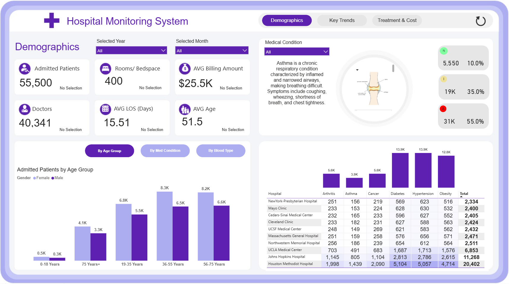
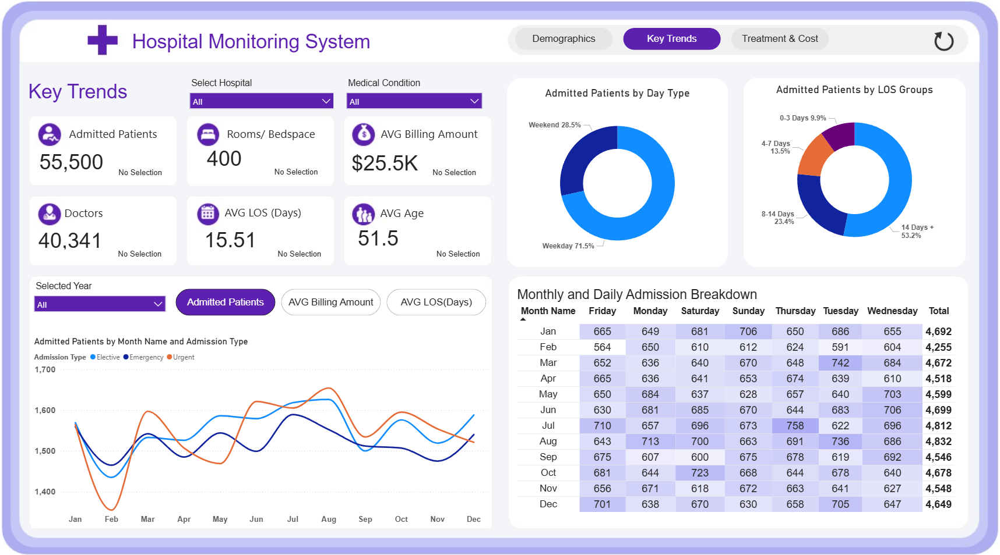
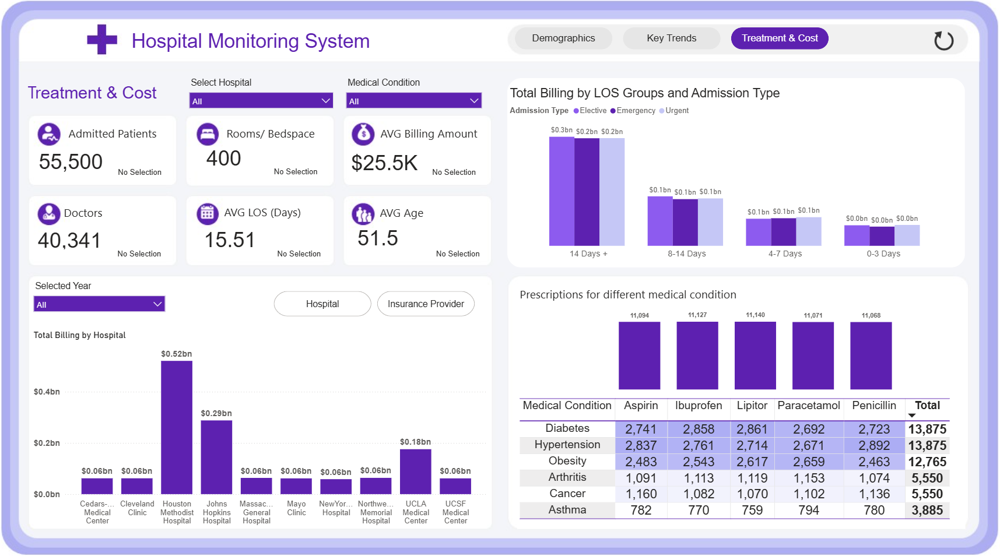

This interactive multipage Power BI dashboard is designed to monitor and analyze key healthcare operations within a hospital network. It provides a comprehensive view of patient demographics, hospital trends, and treatment costs. The dashboard helps healthcare professionals and administrators make data-driven decisions to improve patient care, optimize resources, and manage financial performance.

🧩 Dashboard Segments:  
1️⃣ Demographics Dashboard  
This section provides an overview of:  
•	Total Admitted Patients  
•	Number of Doctors & Beds  
•	Average Length of Stay (LOS)  
•	Patient Age Groups & Billing Amounts  
•	Medical Condition Segmentation (by Age, Gender, Blood Type)  
•	Top Diagnosed Conditions by Hospital  
✅ Key Insights:  
•	Highest admission in the 56–75 age group  
•	Hypertension and Diabetes are the most common medical conditions  
•	Top-performing hospitals include NewYork-Presbyterian and Mayo Clinic  
📊 KPI Monitors:  
•	Total Admitted Patients: 55,500  
•	Total Doctors: 40,341  
•	Average Billing Amount: $25.5K  
•	Average Length of Stay: 15.51 Days  
•	Average Age: 51.5 Years
________________________________________

2️⃣ Key Trends Dashboard  
This section focuses on time-based and categorical trends:  
•	Admissions over months  
•	Patient distribution by admission type and LOS groups  
•	Weekly and daily admission patterns  
✅ Key Insights:  
•	Most patients are admitted on weekdays (71.5%)  
•	Peak admissions occur in March and November  
•	LOS group "4–14 Days" dominates admission data (~55%)  
📊 KPI Trends:  
•	Emergency admissions show greater month-to-month variability  
•	Most stable LOS category is 0–3 days with lowest admission share
________________________________________

3️⃣ Treatment & Cost Dashboard  
This tab tracks financial and medical resource allocation:  
•	Total billing by hospital and LOS  
•	Comparison across hospitals and insurance providers  
•	Prescriptions for various medical conditions  
✅ Key Insights:  
•	Cleveland Clinic generates the highest total billing (~$0.52Bn)  
•	Penicillin and Paracetamol are most prescribed drugs  
•	Diabetes and Hypertension drive high prescription rates  
📊 Financial KPIs:  
•	Total Billing (Top Hospital): $0.52B (Cleveland Clinic)  
•	Billing by LOS Group: 14+ days category contributes highest revenue  
•	Most Prescribed Medication: Penicillin (11,046 times)
________________________________________

🛠️ Tools Used:  
•	Power BI  
•	DAX Measures  
•	Visual Slicers & Filters  
•	Line Charts, Donut Charts, Bar Graphs, and Matrix Tables  

Live Link: https://app.powerbi.com/view?r=eyJrIjoiZDk4ZDI3MDgtMzUwZi00NGVlLTgwNzUtNGRiYzM5YzVmNGIzIiwidCI6IjJkNzAwYjkwLTE4ZWEtNDUxOS05M2YyLWViMGViZDljOWI5NCJ9
